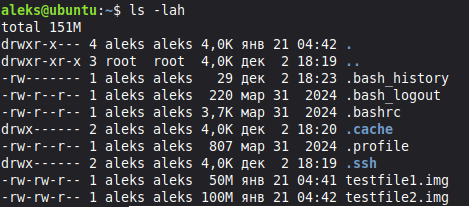
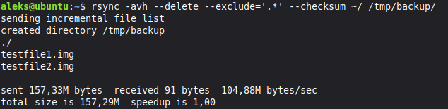
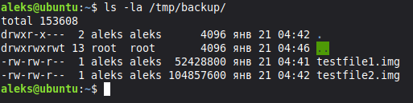
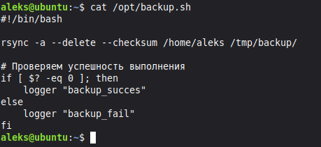
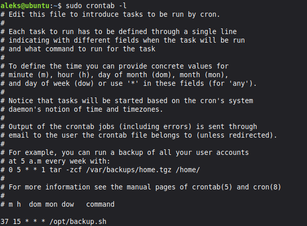
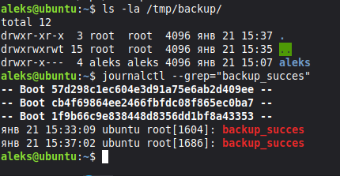
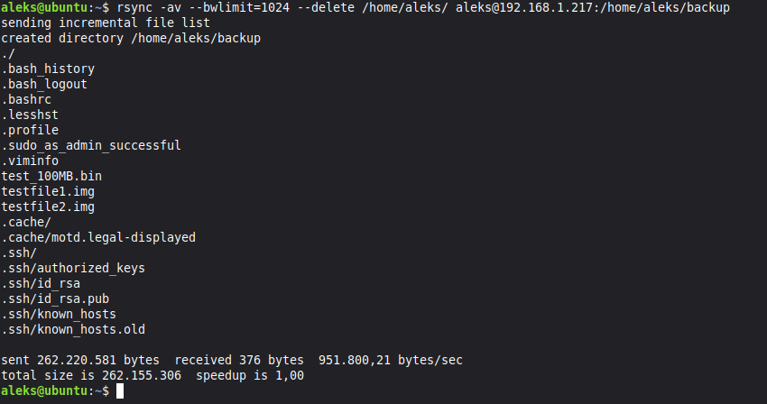
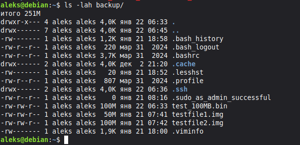

# Домашнее задание к занятию 3
## «Резервное копирование»

# Задание 1

Задание 1
 1. Составьте команду rsync, которая позволяет создавать зеркальную копию домашней директории пользователя в директорию /tmp/backup
 2. Необходимо исключить из синхронизации все директории, начинающиеся с точки (скрытые)
 3. Необходимо сделать так, чтобы rsync подсчитывал хэш-суммы для всех файлов, даже если их время модификации и размер идентичны в источнике и приемнике.

 На проверку направить скриншот с командой и результатом ее выполнения

**Решение:**

*домашняя директория*

*команда rsync*

*директория /tmp/backup*

# Задание 2

Задание 2
 1. Написать скрипт и настроить задачу на регулярное резервное копирование домашней директории пользователя с помощью rsync и cron.
 2. Резервная копия должна быть полностью зеркальной
 3. Резервная копия должна создаваться раз в день, в системном логе должна появляться запись об успешном или неуспешном выполнении операции
 4. Резервная копия размещается локально, в директории /tmp/backup

 На проверку направить файл crontab и скриншот с результатом работы утилиты.

**Решение**

*скрипт backup*

*настройки crontab*

*результат и лог*

# Задание 3

Задание 3*
 1. Настройте ограничение на используемую пропускную способность rsync до 1 Мбит/c
 2. Проверьте настройку, синхронизируя большой файл между двумя серверами

 На проверку направьте команду и результат ее выполнения в виде скриншота

**Решение**

*backup на внешний сервер с ограничением скорости*

*backup директория*
